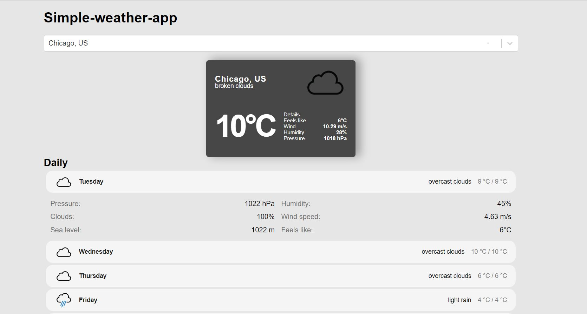

# Simple weather app using React and OpenWeather API.
This project is inspired by freeCodeCamp.org's YouTube video "React JS Tutorial – Build a Weather App With Cities Autocomplete".

The link for the YouTube video "React JS Tutorial – Build a Weather App With Cities Autocomplete" by freeCodeCamp.org:
https://www.youtube.com/watch?v=Reny0cTTv24

This project is created using React and OpenWeatherAPI.

